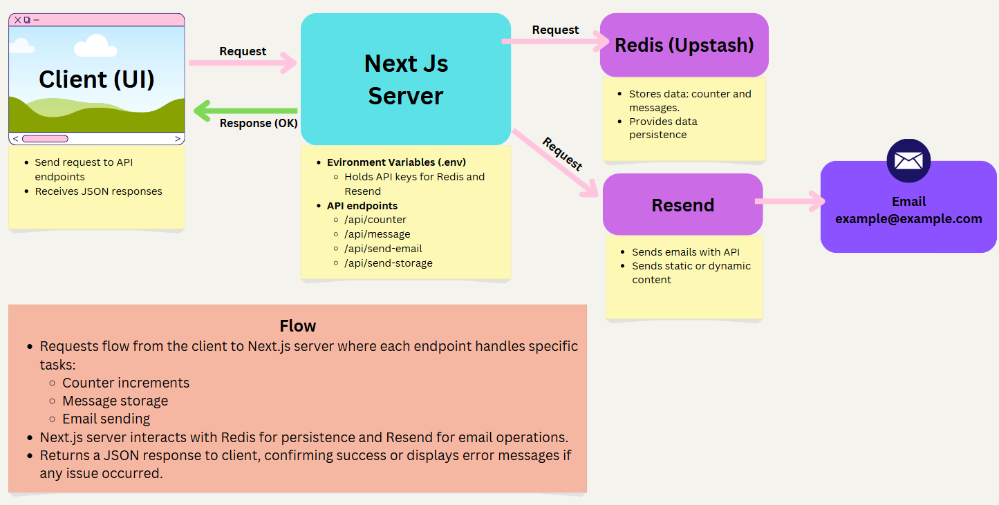

# Server Project

## Overview:

This Next.js project demonstrates how to build and manage a server with multiple functionalities using Upstash Redis for data persistence and Resend for email integration. The project covers:

1. **Counter Increment Endpoint (`/api/counter.js`):** Increments a stored counter and returns the updated count.
2. **Message Storage Endpoint (`/api/message.js`):** Stores messages sent to the endpoint in Upstash.
3. **Email Sending Endpoint (`/api/send-email.js`):** Sends an email with a static message.
4. **Send and Store Endpoint(`/api/send-storage.js`) :** Combines email sending and message storage functionalities.

## Part 1: Email Integration

### Project Overview

The goal of this part is to set up a Next.js API endpoint that can send an email when requested. The server integrates with Resend, an email-sending service, to manage and deliver emails. This setup is part of a larger server project that will later include data persistence and user interaction tracking.

## Setup Instructions

1. Setup the Project

   - Intialize a Next.js Project, navigate to project folder, and open VS Code.

   ```bash
   npx create-next-app@latest
   cd server-project
   code .
   ```

   - Sync project to Github.

   ```bash
   git remote add origin <repo url>
   git branch -M main
   git push -u origin main
   ```

   - Install dependencies:

   ```bash
   npm i resend
   npm install @upstash/redis
   ```

   - Create a `.env.local` file in the project root, and add Resend & Upstash KV API keys:

   **NOTE:** To get Upstash API key:

   1. Deploy Project on Vercel.
   2. Navigate to `Storage` on deployed project's dashboard.
   3. Click `Create Database` button, select `Upstash` then `Upstash KV`.
   4. Following the Database setup instructions will give you access to your keys.

   ### Evironment Variables(.env)

   ```bash
   RESEND_API_KEY=<your resend api key>
   KV_URL=<copied from vercel>
   KV_REST_API_READ_ONLY_TOKEN=<copied from vercel>
   KV_REST_API_TOKEN=<copied from vercel>
   KV_REST_API_URL=<copied from vercel>
   ```

   - Then, run the development server:

   ```bash
   npm run dev
   # or
   yarn dev
   # or
   pnpm dev
   # or
   bun dev
   ```

   Open [http://localhost:3000](http://localhost:3000) with your browser to see the result.

## Installation Steps

Clone the repository and navigate into the project folder:

```bash
git clone <repository-url>
cd <project-folder>
```

Install dependencies:

```bash
npm install
```

Run the development server:

```bash
npm run dev
```

## API Endpoints

### Counter Increment Endpoint (`/api/counter.js`)

#### Description

The Counter Increment endpoint interacts with Upstash Redis to store and retrieve a counter value. Each time the endpoint is accessed, it increments the counter by 1 and returns the updated value.

**Usage:** This endpoint is useful for tracking page views, visitor counts, or any other metric that requires a simple increment operation.

#### Example Request:

```
GET /api/counter
```

#### Response Format:

```json
{
  "count": <current_count>
}
```

#### Code Explanation

```js
// pages/api/counter.js
import { Redis } from "@upstash/redis";

const redis = Redis.fromEnv();

export default async function handler(req, res) {
  try {
    const count = await redis.incr("counter");
    res.status(200).json({ count });
  } catch (error) {
    console.error("Error incrementing counter: ", error);
    res.status(500).json({ message: "Error incrementing counter" });
  }
}
```

- `redis.incr("counter")`: Increments the `counter` key in Redis, creating it if it doesn’t exist.

### Message Storage Endpoint (`/api/message.js`)

#### Description

The Message Storage endpoint accepts a message as a query parameter and stores it in a Upstash/Redis list.

**Usage:** This is particularly useful for logging events or messages in real-time, enabling a message history.

#### Query Parameters:

- `message`: The content to be stored.

#### Example Request:

```
GET /api/message?message=Hello%20World
```

#### Response Format:

```json
{
  "success": true,
  "message": "Message stored successfully!"
}
```

#### Code Explanation

```js
// pages/api/message.js
import { Redis } from "@upstash/redis";

const redis = Redis.fromEnv();

export default async function handler(req, res) {
  try {
    const { message } = req.query;

    if (!message) {
      return res.status(400).json({ error: "Message is required" });
    }

    await redis.rpush("messages", message);
    res
      .status(200)
      .json({ success: true, message: "Message stored successfully!" });
  } catch (error) {
    console.error("Error storing message: ", error);
    res.status(500).json({ success: false, message: "Error storing message" });
  }
}
```

- `redis.rpush("messages", message)`: Adds the message to the end of the `messages` list in Upstash/Redis.

### Email Sending Endpoint (`/api/send-email.js`)

#### Description

The Email Sending endpoint demonstrates Resend integration by sending a static email.

**Usage:** This functionality is essential for applications needing notifications, onboarding emails, or confirmations.

#### Example Request:

```
GET /api/send-email
```

#### Response Format:

```json
{
  "message": "Email sent!"
}
```

#### Code Explanation

```js
// pages/api/send-email.js
import { Resend } from "resend";

const API_KEY = process.env.RESEND_API_KEY;
const resend = new Resend(API_KEY);

export default async function handler(req, res) {
  try {
    await resend.emails.send({
      from: "Acme <onboarding@resend.dev>",
      to: ["delivered@resend.dev"],
      subject: "Hello, does this work?",
      html: "<p>Yay it is working!</p>",
    });
    res.status(200).json({ message: "Email sent!" });
  } catch (error) {
    console.error("Error sending email: ", error);
    res.status(500).json({ message: "Error sending email!" });
  }
}
```

- `resend.emails.send()`: Sends an email with pre-defined fields like `subject` and `html` content.

### Send and Store Endpoint (`/api/send-storage.js`)

#### Description

The Send and Store endpoint combines email sending and message storage. It accepts both `message` and `email` parameters, sends the message via email to the specified address, and stores the message in Upstash/Redis.

**Usage:** This endpoint is ideal for applications requiring message-based notifications with a history log.

#### Query Parameters:

- `message`: The message content to send and store.
- `email`: The recipient’s email address.

#### Example Request:

```
GET /api/send-storage?message=Hello&email=user@example.com
```

#### Response Format:

```json
{
  "success": true,
  "message": "Email sent and latest message stored!"
}
```

#### Code Explanation

```js
// pages/api/send-storage.js
import { Redis } from "@upstash/redis";
import { Resend } from "resend";

const API_KEY = process.env.RESEND_API_KEY;
const redis = Redis.fromEnv();
const resend = new Resend(API_KEY);

export default async function handler(req, res) {
  try {
    const { message, email } = req.query;

    if (!message || !email) {
      return res.status(400).json({ error: "Message and email are required" });
    }

    await resend.emails.send({
      from: "Acme <onboarding@resend.dev>",
      to: email,
      subject: "New Message Received",
      text: `You received a new message: ${message}`,
    });

    await redis.set("latest_message", message);
    res.status(200).json({
      success: true,
      message: "Email sent and latest message stored!",
    });
  } catch (error) {
    console.error("Error in send-storage endpoint: ", error);
    res.status(500).json({
      success: false,
      message: "Error sending email or storing message",
    });
  }
}
```

- `resend.emails.send()`: Sends an email containing the `message`.
- `redis.set("latest_message", message)`: Stores the latest message in Redis.

## Project Architecture Diagram



## Part 2: API and Redis Integration

### Project Overview

This project includes two main pages:

1. **Contact Me:** A form for users to submit a message and email, which triggers an email to the specified address and stores the message in Redis.
2. **All Messages:** Displays all stored messages, with a refresh button to update the list of messages from Redis.
   Two main API routes support these pages:

`/api/send-storage`: Sends a message email and stores the message in Redis.
`/api/get-messages`: Retrieves all stored messages from Redis.

### API Routes

#### `/api/send-storage`

This route handles incoming `POST` requests from the Contact Me form.

**Key Functions**

- Resend: Sends an email to the specified recipient.
- Redis (`rpush`): Adds the message to the Redis list, `messages`, to keep a history of all messages.

**Key Concepts**

- `req.body`: The request body holds the user’s `email`, `message`, and optionally a `subject`. We extract these values using `req.body` and validate them before proceeding.

#### `/api/get-messages`

This route handles `GET` requests from the All Messages page and retrieves the list of stored messages from Redis.

**Key Functions**

- Redis (`lrange`): Retrieves all messages stored in the Redis list `messages`.
  **Key Concept**
- Redis Commands:

  - `lrange`: Gets a range of values from a Redis list. By specifying `0` and `-1` as the range, we retrieve all messages in the list.

  ### Pages

  #### Contact Me Page

  This page contains a form that lets users enter their email, subject, and message. Submitting the form sends the data to `/api/send-storage`, which emails the user’s message and stores it in Redis.

  #### All Messages Page

  This page retrieves and displays all stored messages using the `/api/get-messages` API route. A refresh button allows the user to re-fetch messages from Redis.

  ## Reflection

  ### Summary of Key Concepts and Techniques

  While building this project, I learned how to use API endpoints with `fetch`, and state management with React hooks like `useState` and `useEffect`. By using `fetch`, I was able to interact with the API to store messages on the `Contact Me` page and retrieve them on the `All Messages` page. Here’s a breakdown of how each of these worked:

  `fetch`: Used to send and retrieve data from the server. For example, in `Contact Me`, fetch was used to make a `POST` request to `/api/send-storage`, sending user-provided data (email, message, subject) in the request body. Similarly, fetch was used on `All Messages` to retrieve stored messages via a `GET` request to `/api/get-messages`.

  `useState`: Managed component state, such as storing the message and email fields for form submission and handling loading states. It also updated the list of messages displayed on `All Messages`.

  `useEffect`: Handled side effects by fetching messages on page load, so that users can see all messages immediately. `useEffect` was also used with a `handleRefresh` function to re-fetch messages when users click the refresh button.

### Challenges and Solutions

1. **Request Body Management:** Ensuring that required fields (`email`, `message`, `subject`) were present in each form submission was critical for successful requests.

- **Solution:** Validation was added both on the frontend and backend, ensuring complete data was sent and preventing errors during processing.

2. **Using Redis Commands:**

- Challenge: Choosing the right Redis command was important to ensure messages were stored and retrieved in the correct order.
- **Solution** Using `rpush` allowed messages to be added to the end of a list, keeping them in chronological order. `lrange` was then used to retrieve all messages when needed.
  ### Lessons Learned
  This project reinforced the importance of selecting the right data structure and commands based on specific needs. By using `rpush`, I maintained the chronological order of messages, making it easy to retrieve a complete history using `lrange`. This experience taught me how to manage both data storage and retrieval more effectively, especially when dealing with asynchronous fetch requests and React state updates.
